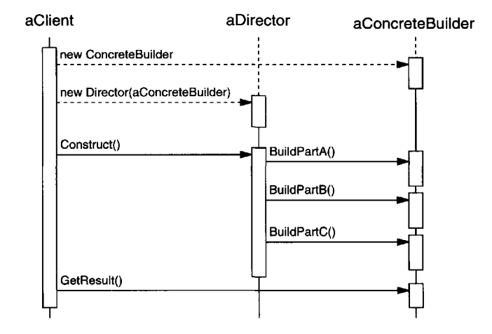

# Builder

## Objective

Separate the construction of a complex object from its representation so that the same construction process can create different representations.

## Applicability

Use the Builder pattern when :

- The algorithm for creating a complex object should be independent of the parts that make up the object and how they're assembled.
- The construction process must allow different representations for the object that's constructed.

## Implementation

```Java
class Product {
    String CPU;
    String GPU;
    int RAM;
    String diskDriver;

    void Show(){
        if (this.CPU != null)
            System.out.println("\tCPU : "+ this.CPU);
        if (this.GPU != null)
            System.out.println("\tGPU : "+ this.GPU);
        if (this.RAM != 0)
            System.out.println("\tRAM : "+ this.RAM + "GB");
        if (this.diskDriver != null)
            System.out.println("\tDisk Driver : "+ this.diskDriver);
    }
}
```

Starting off by making a Product class that contains the parts we want to add to each product.

```Java
interface IBuilder {
    void BuildPC();
    void InsertCPU();
    void InsertGPU();
    void AddRAM();
    void addDiskDriver(String dd);
    Product GetPC();
}
```

Ihe IBuilder interface is implemented by all the ConcreteBuilder classes.

```Java
class Director {
    IBuilder myBuilder;

    // A series of steps—for the production
    public void Construct(IBuilder builder) {
        myBuilder = builder;
        myBuilder.BuildPC();
        myBuilder.InsertCPU();
        myBuilder.InsertGPU();
        myBuilder.AddRAM();
    }
}
```

The client creates the Director object and configures it with the desired Builder object.
In this Construct method we choose to add all the parts except for the disk driver, but you can easily choose the parts you want to add simply by not calling the add-method of that particular part in the director Construct method.



Director notifies the builder whenever a part of the product should be built.

Builder handles requests from the director and adds parts to the product.

The client retrieves the product from the builder.

```Java
// MyPC is ConcreteBuilder
class MyPC implements IBuilder {
    private Product product = new Product();

    @Override
    public void BuildPC() {
        System.out.println("Building My PC...");
    }

    @Override
    public void InsertCPU() {
        product.CPU = "Intel i9 CPU";
    }

    @Override
    public void InsertGPU() {
        product.GPU = "RTX 3060 GPU";
    }

    @Override
    public void AddRAM() {
        product.RAM = 32;
    }
    
    @Override
    public void addDiskDriver(String dd) {
        product.diskDriver = dd;
    }

    @Override
    public Product GetPC() {
        return product;
    }
}
```

The first ConcreteBuilder we made is a class called MyPC that builds the PC parts for me.

```Java
// OthersPC is a ConcreteBuilder
class OthersPC implements IBuilder {
    private Product product = new Product();

    @Override
    public void BuildPC() {
        System.out.println("Building Your PC...");
    }

    @Override
    public void InsertCPU() {
        product.CPU = "Ryzen 9 CPU";
    }

    @Override
    public void InsertGPU() {
        product.GPU = "RX 7800 XT GPU";
    }

    @Override
    public void AddRAM() {
        product.RAM = 16;
    }

    @Override
    public void addDiskDriver(String dd) {
        product.diskDriver = dd;
    }

    @Override
    public Product GetPC() {
        return product;
    }
}
```

The second ConcreteBuilder we made is a class called OthersPC that builds the PC parts for other people.

```Java
public class App {
    public static void main(String[] args) {
        System.out.println("***Builder Pattern Demo***");
        Director director = new Director();
        IBuilder myPCBuilder = new MyPC();
        IBuilder yourPCBuilder = new OthersPC();
        // Making My PC
        director.Construct(myPCBuilder);
        Product p1 = myPCBuilder.GetPC();
        p1.Show();
        // Making Your PC
        director.Construct(yourPCBuilder);
        // adding optional parameter
        yourPCBuilder.addDiskDriver("SSD");
        Product p2 = yourPCBuilder.GetPC();
        p2.Show();
    }
}
```

In the main, we choose to add a disk driver to the `Your PC`.
This parameter is optional as it was not defined in the director constructor method.

Now we run this code to test the design pattern and the output should be :

```Terminal
***Builder Pattern Demo***
Building My PC...
        CPU : Intel i9 CPU
        GPU : RTX 3060 GPU
        RAM : 32GB
Building Your PC...
        CPU : Ryzen 9 CPU
        GPU : RX 7800 XT GPU
        RAM : 16GB
        Disk Driver : SSD
```

## Consequences

Here are key consequences of the Builder pattern:

- It lets you vary a product's internal representation.
- It isolates code for construction and representation.
- It gives you finer control over the construction process.

## Related Patterns

[Abstract Factory](../Abstract%20Factory/README.md) is similar to Builder in that it too may construct complex objects. The primary difference is that the Builder pattern focuses on constructing a complex object step by step. Abstract Factory's emphasis is on families of product objects (either simple or complex). Builder returns the product as a final step, but as far as the Abstract Factory pattern is concerned, the product gets returned
immediately.
A [Composite](https://) is what the builder often builds.
